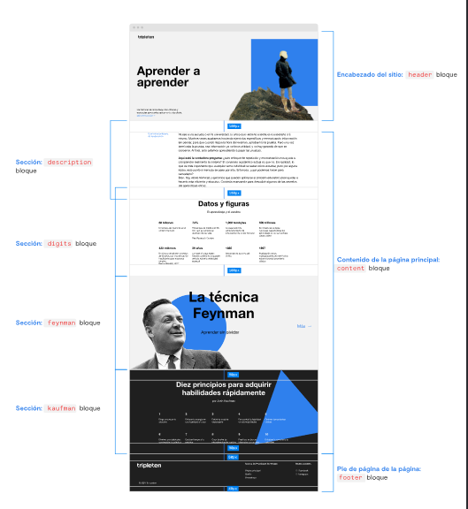

# Web Aprender a aprender

## Este es un proyecto adicional para prácticar mis habilidades con flexbox, position, asignar las clases de acuerdo con la metodología BEM.

## Se compone de 6 bloques, cada uno con su clase correspondiente

## Actualmente me encuentro terminando el bloque de "Description", que consiste en la elaboración de una tabla realizada con flex conjuntamente con algunos apartados descriptivos.

## El resultado final será el mostrado en la imagén anterior con la posibilidad de agregarle más funciones y estilos

# Lo que falta:

## Agregar la sección del Footer
